<p align="center">
  
</p>

<h1 align="center">DIAN-115</h1>

<p align="center">
  <strong>115 网盘媒体自动化与 Emby/Navidrome 运营控制台</strong><br/>
  从资源发现、订阅、转存、下载、整理、STRM、Emby 入库、播放代理、分享，到旧库迁移和日常维护的一体化工具。
</p>

<p align="center">
  <a href="https://madbrolab.github.io/dian115/">完整 Wiki</a>
  ·
  <a href="https://t.me/dian115group">Telegram 群组</a>
</p>

<p align="center">
  
  
  
  
</p>

> DIAN-115 是私有授权项目。普通用户使用发布镜像部署即可，README 不提供源码构建指引。

## 完整 Wiki

项目的完整使用说明已经发布到 GitHub Pages：

[https://madbrolab.github.io/dian115/](https://madbrolab.github.io/dian115/)

Wiki 按真实使用顺序整理：部署、旧 Emby 库迁移、115/CD2/Emby/Madby/FFP 配置、资源发现、订阅、下载、整理、STRM、入库、分享和排障维护。

## 项目截图

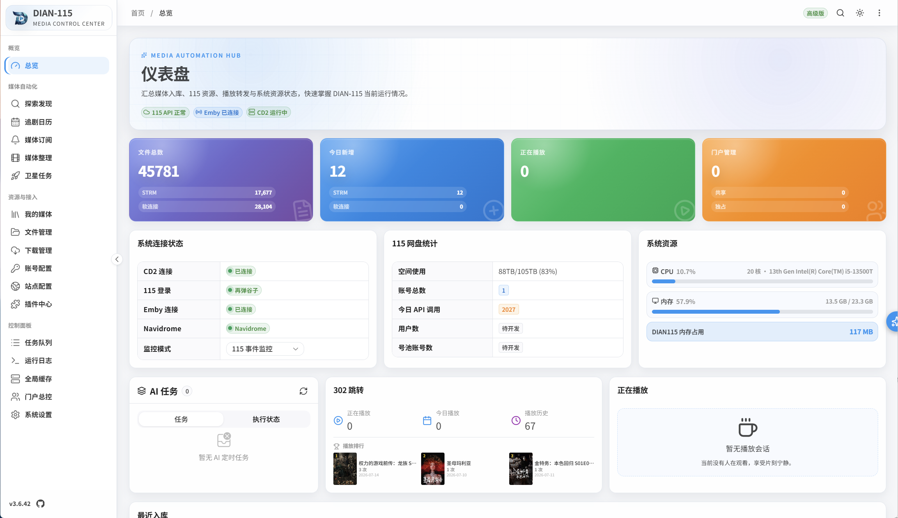

<p align="center">
  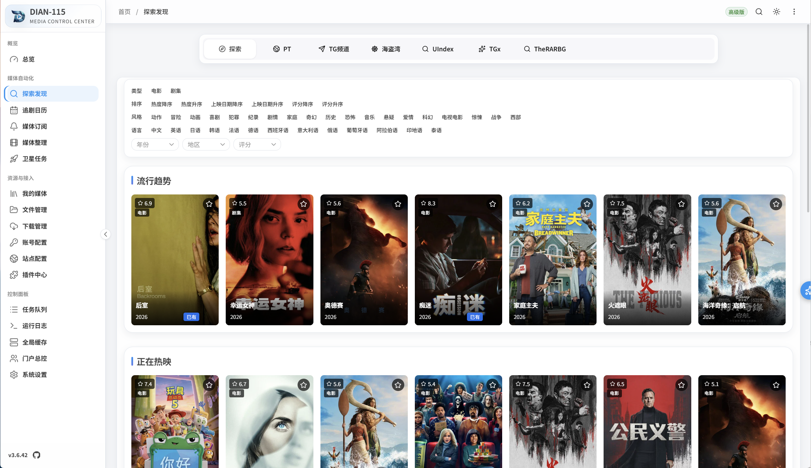
  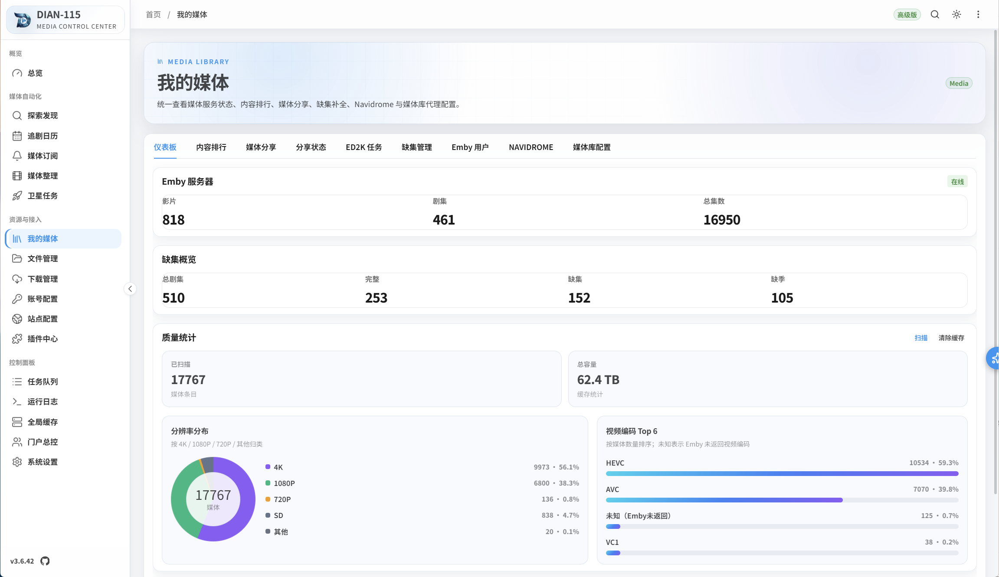
</p>

<p align="center">
  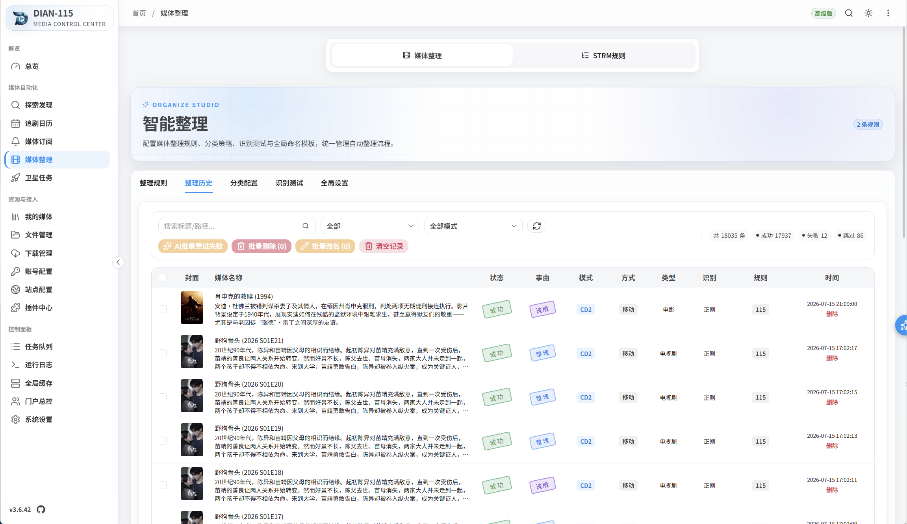
  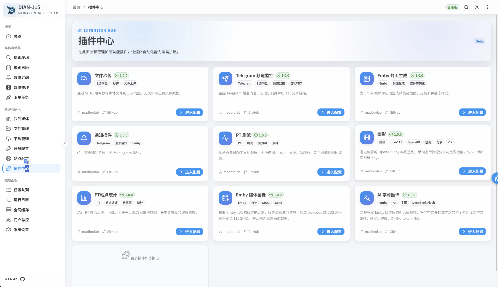
</p>

<p align="center">
  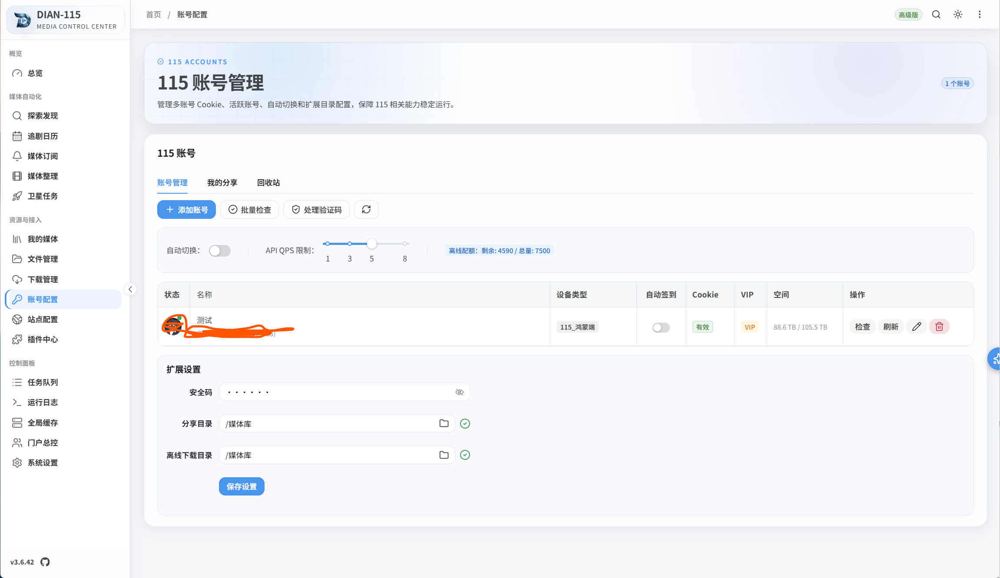
  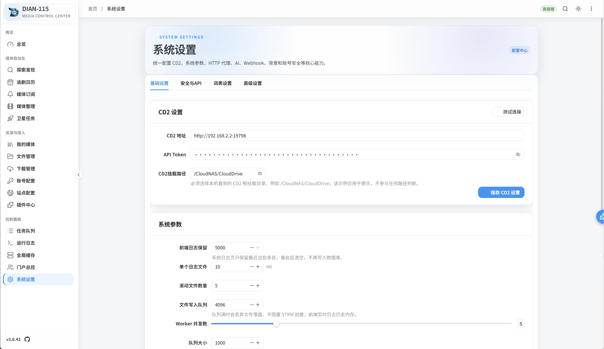
</p>

<details>
<summary>查看更多截图</summary>

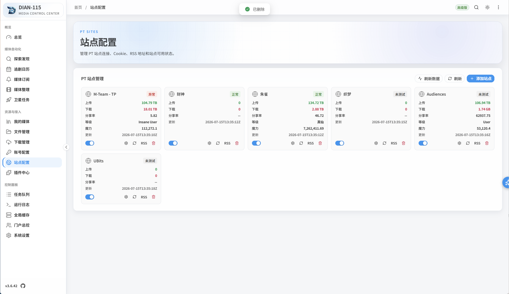
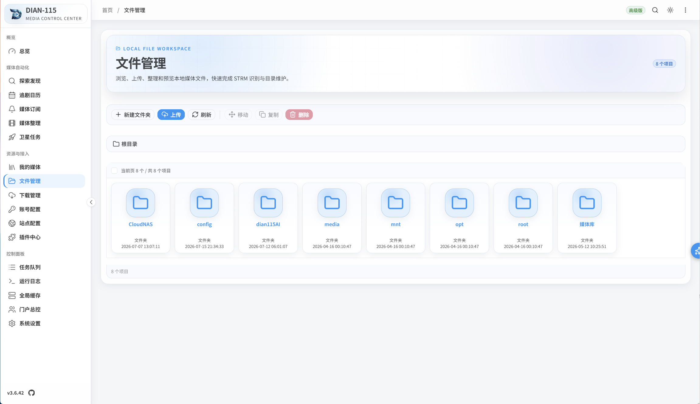
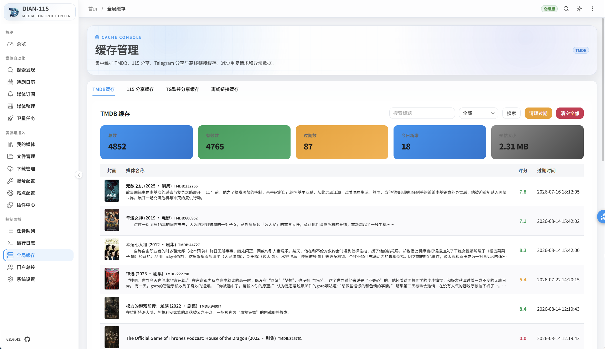
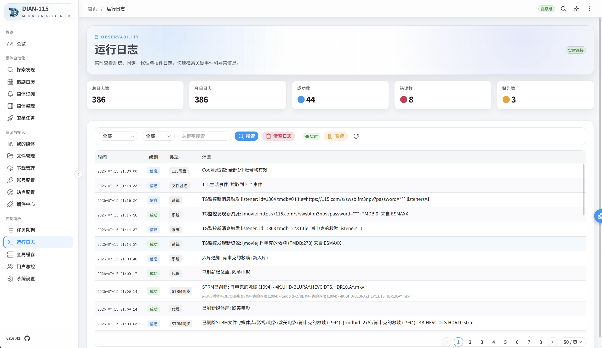

</details>

## DIAN-115 能做什么

DIAN-115 不是单纯的文件管理器，也不是只展示前端界面的面板。它把 115 网盘、CloudDrive2、Emby、Navidrome、PT 站点、Telegram、癫影、Madby、FFP、AI 和通知能力串成完整媒体自动化流程。

核心能力包括：

- 115 多账号管理、Cookie 健康检查、离线下载、分享、回收站维护。
- CloudDrive2 路径配置、115 挂载路径识别、CD2 到 CD2 云端整理。
- 探索发现、PT 搜索、RSS、Telegram 频道监控、UIndex、TGx、TheRARBG、海盗湾、癫影资源接入。
- 电影、电视剧、演员订阅，支持 PT/TG/癫影/聚合策略。
- 媒体整理、命名模板、分类规则、洗版、多版本、TMDB 刮削、AI 辅助识别。
- STRM 规则、目录树同步、全量/增量/实时同步、孤立清理、链接模式。
- Emby 代理、Webhook、Madby 事件接入、缺集检测、媒体分享、用户运营。
- Navidrome 音乐代理、音乐目录树、Song ID 同步、软链接生成。
- 插件中心：秒传上传、TG 频道监控、通知、Emby 封面、PT 刷流、癫影、PT 站点统计、Emby 媒体画像、AI 字幕翻译。
- 系统设置：OpenAPI Key、Webhook、HTTP 代理、FlareSolverr、AI 模型、词表、日志、缓存和安全配置。
- 用户门户仅作为用户端入口提供注册、登录、求片、续期等能力，不是项目主流程重点。

## 部署方法

### Docker Compose 推荐方式

GitHub Pages Wiki 与 README 都以发布镜像部署为准。新建目录，保存 `docker-compose.yml`：

```yaml
services:
  dian115:
    image: madbrolab/dian115
    container_name: dian115
    restart: unless-stopped
    network_mode: host
    volumes:
      - ./config:/config
      - ./media:/media
      - ./CloudNAS:/CloudNAS:shared
```

启动：

```bash
docker compose up -d
```

访问：

```text
http://<服务器IP>:8095
```

首次进入需要设置管理员密码；如果授权守卫提示激活，按页面提示填写 License Key。

### 桥接网络或反向代理场景

如果 Docker 环境不适合使用 `host` 网络，或者需要反向代理统一入口，可以改用端口映射：

```yaml
services:
  dian115:
    image: madbrolab/dian115
    container_name: dian115
    restart: unless-stopped
    ports:
      - "8095:8095"
      - "8098:8098"
      - "4534:4534"
    volumes:
      - ./config:/config
      - ./media:/media
      - ./CloudNAS:/CloudNAS:shared
    environment:
      - PORT=8095
      - TZ=Asia/Shanghai
      # - DIAN115_HTTP_PROXY=http://代理服务器IP:7890
```

### 端口与目录

| 项目 | 默认值 | 用途 |
| --- | --- | --- |
| 主服务端口 | `8095` | Web 管理后台、API、插件入口 |
| Emby 代理端口 | `8098` | Emby 反向代理、播放重定向，页面中可自定义 |
| Navidrome 代理端口 | `4534` | 音乐库代理，不用可不暴露 |
| 调试端口 | `6060` | pprof / 调试，仅排障时内网开放 |
| 数据目录 | `/config` | 数据库、配置、缓存，必须持久化 |
| 媒体目录 | `/media` | Emby 可见媒体或 STRM 输出目录 |
| CD2 挂载目录 | `/CloudNAS` | CloudDrive2 115 挂载根目录 |

## FlareSolverr 部署

UIndex 等资源站可能触发 Cloudflare 验证。需要这类站点时，单独部署 FlareSolverr，然后在 DIAN-115 系统设置里填写服务地址并测试。

```yaml
services:
  flaresolverr:
    image: ghcr.io/flaresolverr/flaresolverr:latest
    container_name: flaresolverr
    restart: unless-stopped
    ports:
      - "8191:8191"
    environment:
      - LOG_LEVEL=info
      - LOG_FILE=none
      - LOG_HTML=false
      - CAPTCHA_SOLVER=none
      - TZ=Asia/Shanghai
    volumes:
      - ./flaresolverr:/config
```

服务地址填写参考：

| 部署关系 | DIAN-115 中填写 |
| --- | --- |
| 同一个 Compose 桥接网络 | `http://flaresolverr:8191` |
| DIAN-115 使用 host 网络，FlareSolverr 在同一宿主机 | `http://127.0.0.1:8191` 或 `http://服务器IP:8191` |
| 分别部署在不同机器 | `http://FlareSolverr机器IP:8191` |

`8191` 端口建议只在内网访问，不要直接暴露到公网。首次请求可能较慢，这是浏览器环境启动导致的正常现象。

## 旧 Emby 库迁移重点

如果你已经用其它工具生成过 Emby 媒体库，请先处理旧库迁移，再做大规模 STRM 生成。

Emby 媒体画像是旧库迁移的关键插件，不是普通辅助工具。推荐流程：

1. 先完成最小基础配置：管理员、授权、115 账号、CD2 地址/API Token、CD2 挂载路径。
2. 在 STRM 规则中先构建目录树，不要立刻生成 STRM。
3. 打开 Emby 媒体画像插件，连接旧 Emby 地址和 API Key，拉取旧库媒体条目、文件路径和媒体画像。
4. 配置路径替换，把旧 Emby 路径映射到 DIAN-115 新的 115/CD2 目录树。
5. 配置 Madby 插件，填写 DIAN-115 地址和 OpenAPI Key，避免原生 Webhook 与 Madby 重复通知。
6. 将可用画像上报到癫影 SHA1 FFP，保留旧库识别成果。
7. 确认路径匹配、Madby、FFP 和通知链路都正常后，再生成新 STRM，并让新的或干净的 Emby 媒体库扫描。

最容易出错的是还没完成旧路径匹配，就同时打开新 STRM 生成和 Emby 大规模扫描。这样会让旧库画像、新 STRM、新 Emby 条目混在一起，后面很难排障。

## 推荐配置顺序

普通新装场景建议按这个顺序走：

1. 部署服务，访问 `http://服务器IP:8095`，设置管理员密码。
2. 完成购买与授权激活，确认重启后授权状态仍然存在。
3. 配置 115 账号，保存安全码、分享目录、离线目录，检查 Cookie 健康。
4. 配置 CloudDrive2 地址、API Token、115 挂载路径。
5. 如果迁移旧 Emby 库，先完成 Emby 媒体画像、Madby 和 FFP 流程。
6. 配置 Emby / Navidrome 代理、Webhook、OpenAPI Key。
7. 配置 PT 站点、下载器、RSS、Telegram 通知和 TG 频道监控。
8. 按小范围目录测试媒体整理规则、命名模板、分类和洗版策略。
9. 创建 STRM 规则，先全量建树，再生成 STRM，最后开启实时或定时同步。
10. 配置通知、日志保留、缓存维护和备份计划。

## 完整使用闭环

典型使用路径：

1. 在探索发现、PT 搜索、TG 频道、UIndex、TGx、TheRARBG、海盗湾或癫影中找到资源。
2. 直接转存 115 分享、提交离线下载，或加入电影/电视剧/演员订阅。
3. 下载或转存完成后进入媒体整理规则，识别片名、季集、年份、质量和版本。
4. 按分类和命名模板移动到目标目录，必要时触发洗版、多版本保留或覆盖策略。
5. STRM 规则构建目录树并生成 Emby 可扫描的 STRM 文件。
6. Emby 扫描后，通过 Webhook / Madby / 通知插件进入入库、分享、缺集、播放和统计流程。
7. 日常通过任务队列、运行日志、缓存管理和账号健康检查维护系统。

## 常见维护建议

- 备份优先级：`/config` 目录最高，其次是 STRM 输出目录、路径替换规则、关键插件配置。
- 更新镜像前先备份 `/config`，再执行 `docker compose pull` 和 `docker compose up -d`。
- 115 Cookie、PT Cookie、Telegram Bot Token、OpenAPI Key 不要混用，不要公开。
- FlareSolverr、HTTP 代理、Telegram、TMDB、115 连通性问题优先看系统设置里的网络测试和运行日志。
- 整理规则大改前先用小目录测试，不要直接对大库开启监控。
- 迁移旧库时，先备份旧 Emby 数据库、旧 STRM 输出目录和 DIAN-115 数据库。

## 致谢

- [CloudDrive2](https://www.clouddrive2.com/)
- [Emby](https://emby.media/)
- [Navidrome](https://www.navidrome.org/)
- [TMDB](https://www.themoviedb.org/)
