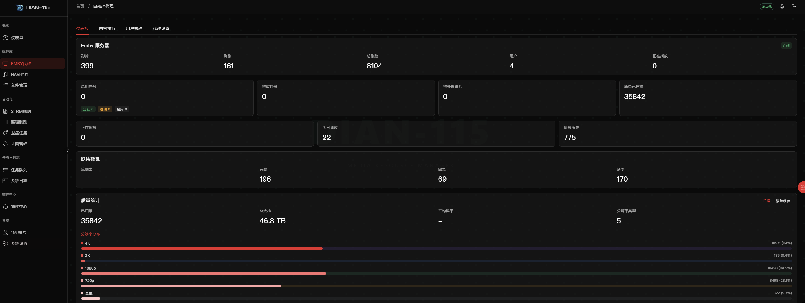
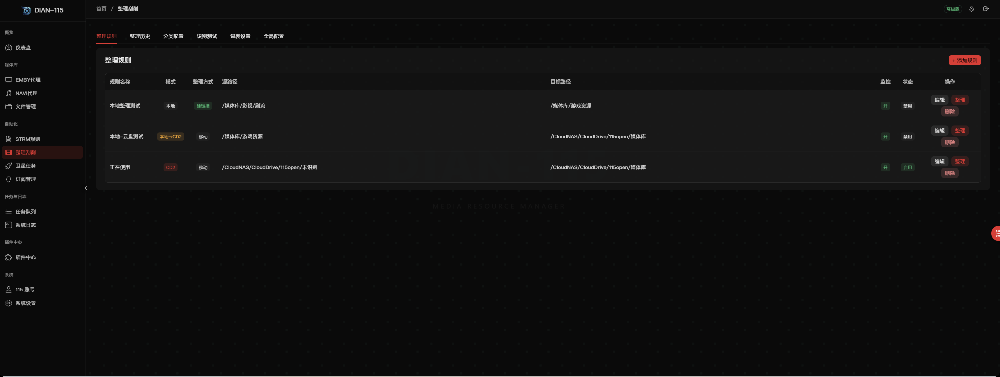
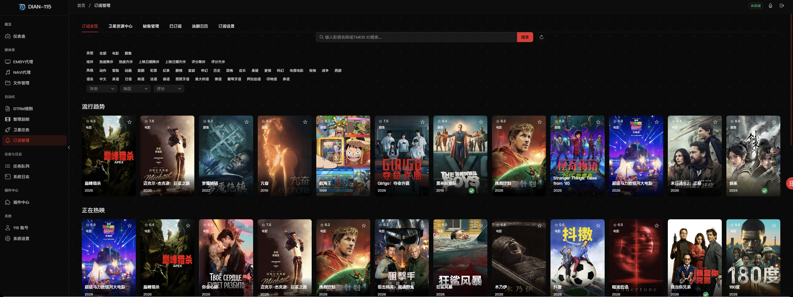
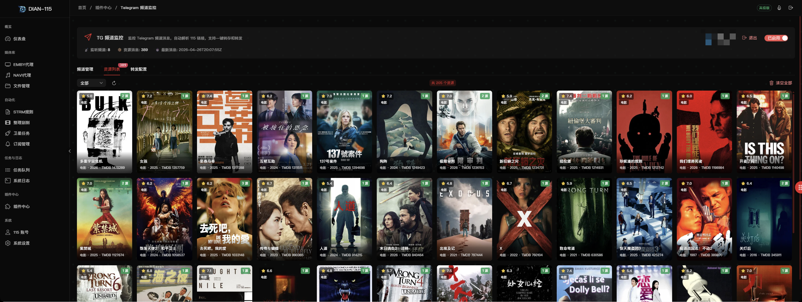

<p align="center">
  
</p>

<h1 align="center">DIAN-115</h1>

<p align="center">
  <strong>115 网盘全能媒体管理平台</strong><br/>
  一站式管理 115 网盘 + Emby/Navidrome 的 STRM 生成、媒体代理、订阅刮削与自动化工具
</p>

<p align="center">
  
  
  
  
  
</p>

---
<p align="center">
  <a href="https://t.me/dian115group">
    
  </a>
</p>

## 📸 界面预览

### 仪表盘


### EMBY 代理


### STRM 规则管理


### 整理刮削


### 订阅管理


### 插件 - Telegram 频道监控



---

## ✨ 功能概览

### 📊 仪表盘
- STRM 文件总数、今日新增、正在播放、规则数等关键指标一览
- 系统状态监控（CPU、内存、磁盘使用率）
- Emby 正在播放会话实时展示（含音乐播放）
- 115 网盘驱动状态 & 重定向统计
- 同步趋势图表
- 工作队列状态

### 🎬 EMBY 代理
- **反向代理**：代理 Emby 服务器，播放时自动拦截并获取 115 直链 302 重定向
- **多代理实例**：支持创建多个 Emby 代理配置，各自独立端口
- **本地回落**：当 115 直链获取失败时，可回落到本地路径播放
- **仪表板**：Emby 媒体库统计（电影/剧集/音乐数量）、分辨率分布（4K/2K/1080p/720p）
- **内容排行**：播放次数排行榜，热门内容一目了然
- **用户管理**：Emby 用户创建、到期管理、邀请码系统、注册审批
- **缺集检测**：自动扫描 Emby 剧集缺集情况，支持一键订阅缺失内容

### 🎵 Navidrome 代理
- 代理 Navidrome 音乐服务器，播放时自动获取 115 直链
- 构建 & 同步音乐目录树
- Song ID 同步、软链接生成
- 支持手动/定时/实时三种同步模式
- 内置音乐播放器（悬浮播放器 + 全屏播放器），支持歌词显示

### 📁 文件管理
- 本地文件系统浏览（列表视图，支持分页）
- 文件/文件夹的创建、重命名、删除、移动、复制
- 文件上传，支持进度显示
- 文件预览（图片、文本、代码等）
- AI 智能识别文件（媒体类型识别）
- 一键整理文件到目标目录

### 📝 STRM 规则
- **多规则管理**：创建多组 STRM 规则，各自对应不同的源路径与输出路径
- **同步模式**：手动同步、定时同步（Cron 表达式）、实时监控
- **全量/增量同步**：支持增量同步和全量同步，减少不必要的扫描
- **智能清理**：自动清理失效的 STRM 文件、元数据文件和空目录
- **链接模式**：支持 path 模式（CD2 路径）和 link 模式（HTTP 链接）
- **元数据联动**：可同步 .nfo / .jpg 等元数据文件
- **排除过滤**：按关键字、文件后缀灵活排除不需要的内容
- **批量操作**：批量启用/禁用/同步/删除规则
- **孤立清理**：一键清理没有对应源文件的孤立 STRM

### 🎞️ 整理刮削
- **自动整理**：按规则将下载的媒体文件整理到标准目录结构
- **智能识别**：解析文件名识别电影/剧集名称、年份、季/集号等信息
- **AI 增强**：可选 AI 大模型辅助识别难以解析的文件名
- **TMDB 刮削**：自动从 TMDB 获取元数据（海报、简介、评分等）
- **FFprobe 分析**：可选使用 FFprobe 分析视频分辨率、编码等信息
- **多种整理模式**：
  - CD2→CD2 云端整理（仅移动）
  - 本地→CD2 上传整理（仅移动）
  - 本地→本地 本地整理（移动/硬链接）
- **重复策略**：跳过、全部保留、大小比较覆盖、评分洗版、多版本洗版
- **分类管理**：支持自定义分类和分类规则
- **监控模式**：定时扫描源目录，发现新文件自动整理
- **整理历史**：完整记录每次整理操作，支持查看详情

### 🚀 卫星任务
- **客户端管理**：创建、管理卫星客户端，分配 API Key
- **目录树发布**：将 STRM 规则的目录树发布给卫星客户端
- **权限控制**：按规则粒度控制每个客户端可访问的内容
- **有效期管理**：支持客户端过期日期设置与续期
- **请求日志**：详细记录卫星客户端的所有请求

### 📢 订阅管理
- **TMDB 浏览**：趋势/热门电影与剧集浏览，支持搜索和筛选
- **智能订阅**：一键订阅电影/剧集，自动下载并入库
- **卫星模式**：支持 MoviePilot 订阅、卫星需求提交等多种模式
- **已有检测**：自动标记已有的媒体资源
- **追番日历**：追剧追番日历视图
- **优先级规则**：自定义资源匹配优先级
- **已订阅列表**：管理所有已订阅的媒体项
- **卫星资源中心**：浏览和管理卫星端资源
- **保存路径设置**：自定义下载保存路径

### ⏱️ 任务队列
- 统一的异步任务队列管理
- 任务状态监控（等待中/执行中/已完成/失败/已取消）
- 任务详情查看、取消、删除
- 工作队列统计（队列深度、活跃 Worker 数等）
- 系统调度任务查看与手动触发

### 📋 系统日志
- 多类型日志分类查看（同步、监控、代理等）
- 日志级别筛选（INFO/WARN/ERROR）
- 关键字搜索
- 实时日志流（WebSocket）
- 日志统计概览
- 一键清理历史日志

### 🔌 插件中心
- **文件秒传**：通过 SHA1 哈希秒传本地文件到 115 网盘，无需实际上传。支持手动秒传和自动监控模式
- **Telegram 频道监控**：监控 TG 频道消息，自动识别 115 分享链接并一键转存。支持自动转发到其他频道
- **Emby 封面生成**：为 Emby 媒体库自动生成精美封面图，支持 4 种静态样式（马卡龙卡片、对角斜切、九宫格拼图、全屏模糊），可自定义字体和参数

### 👤 115 账号
- 多账号管理（添加、编辑、删除）
- 扫码登录 / Cookie 手动设置
- Cookie 有效性检测（单个 / 批量）
- 自动切换失效账号
- API 速率限制设置
- 账号头像和信息展示
- 扩展设置（安全码、分享目录、磁链下载目录）

### ⚙️ 系统设置
- **基础设置**：CD2 地址配置、系统参数（日志保留天数/Worker 并发数/队列大小）、HTTP 代理设置
- **媒体服务**：TMDB API Key / 语言设置、MoviePilot 连接配置
- **通知推送**：Telegram Bot 通知（支持多种通知事件类型）、邮件通知（SMTP 配置）、Webhook 设置
- **安全与API**：登录密码修改、OpenAPI Key 管理
- **高级设置**：AI 模型配置（支持 OpenAI/Azure/Anthropic 等兼容接口）、页面背景设置（Emby 媒体库背景/自定义上传背景）

### 🎨 其他特性
- 🌓 三种主题：亮色 / 暗色 / 红色，暗色主题下支持毛玻璃效果
- 📱 响应式布局，完美适配移动端
- 🤖 内置 AI 对话助手
- 🎵 悬浮音乐播放器
- 🔐 用户认证与安全保护
- 🌏 全中文界面
- 🖥️ 用户门户（Portal）：独立的用户端页面，支持注册/登录/求片/续期

---

## 🚀 快速部署

### Docker Compose（推荐）

1. 创建目录并编写 `docker-compose.yml`：

```bash
mkdir dian115 && cd dian115
```

```yaml
services:
  dian115:
    image: yjnas/dian115
    container_name: dian115
    restart: unless-stopped
    network_mode: host  # 默认使用 host 网络模式；若使用 bridge 模式，请自行映射 8095 端口及所需反代端口
    volumes:
      - ./config:/config        # 配置目录
      - ./media:/media          # 需与 Emby 媒体库挂载路径保持一致
      - ./CloudNAS:/CloudNAS:shared    # CD2 挂载目录
```

2. 启动服务：

```bash
docker compose up -d
```

3. 访问管理界面：

```
http://<你的IP>:8095
```

> 首次访问需设置登录密码。

### 端口说明

| 端口 | 用途 |
|------|------|
| `8095` | Web 管理界面 |
| `8098` | Emby 反向代理（默认，可在代理设置中自定义） |
| `4534` | Navidrome 反向代理（默认，可在代理设置中自定义） |

> 使用 `host` 网络模式时无需手动映射端口。若使用 `bridge` 模式，请自行映射所需端口。

### 目录挂载说明

| 容器路径 | 说明 |
|----------|------|
| `/config` | 配置文件与数据库存储目录 |
| `/media` | 媒体库目录，需与 Emby 的媒体库挂载路径保持一致 |
| `/CloudNAS` | CloudDrive2 的挂载目录 |

---

## 🛠️ 初始配置

首次部署后，通过 Web 界面完成以下基础配置：

### 1. 115 账号设置

进入 **115 账号** 页面：
- 使用 **扫码登录** 或手动填写 **Cookie**
- 支持添加多个 115 账号作为备用

### 2. CloudDrive2 设置

进入 **系统设置 → 基础设置**：
- 填写 CD2 地址（如 `http://localhost:19798`）
- 填写 CD2 API Token
- 设置 115 网盘挂载前缀（如 `/CloudNAS/CloudDrive`）

### 3. Emby 代理配置

进入 **EMBY 代理 → 代理设置**：
- 添加 Emby 服务器地址和 API Key
- 设置代理端口（默认 8098）
- 客户端连接到代理端口即可播放 115 网盘内容

### 4. STRM 规则

进入 **STRM 规则** 页面：
- 添加规则，设置源路径（CD2 挂载路径）和输出路径（本地 STRM 文件生成路径）
- 选择同步模式（手动/定时/实时）
- 点击同步，生成 STRM 文件

### 5. Emby 媒体库

在 Emby 中将 STRM 输出目录添加为媒体库路径。


---

## 📄 许可证

本项目为私有项目，需要有效许可证方可使用。

---

## 🙏 致谢

- [CloudDrive2](https://www.clouddrive2.com/) - 云盘挂载工具
- [Emby](https://emby.media/) - 媒体服务器
- [Navidrome](https://www.navidrome.org/) - 音乐服务器
- [TMDB](https://www.themoviedb.org/) - 电影数据库
- [MoviePilot](https://github.com/jxxghp/MoviePilot) - 自动化媒体管理工具
- [Naive UI](https://www.naiveui.com/) - Vue 3 组件库
