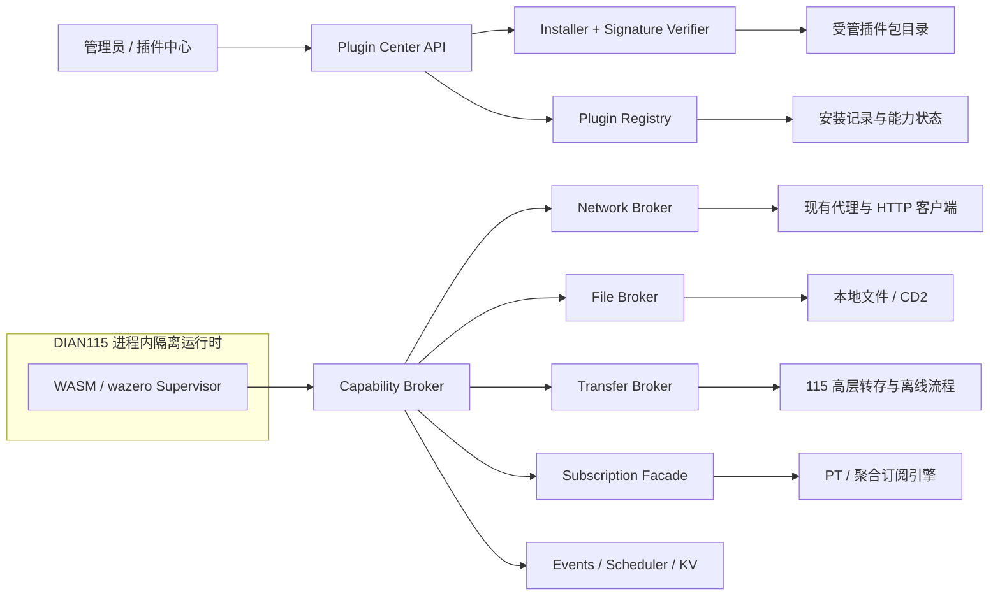

# DIAN115 用户插件平台总体方案

> 状态：Plugin API v1 已在 DIAN115 中提供第三方插件管理与 Host Broker。第三方插件代码随 `.d115p` 安装，由 DIAN115 主进程内的 WASM 监督器运行；不需要 Docker、外部 HTTP 服务、base URL 或远程 runtime 凭据。

Plugin API v1 的当前契约只接受 `runtime.kind=wasm` 清单和 `dian115:plugin@1` ABI；插件代码随包安装并在 DIAN115 主进程内运行。

## 1. 背景与现状

第三方插件通过插件市场、安装记录、声明式 UI 和 Host API 接入：

- 插件中心提供仓库、catalog、安装、更新、启停、卸载和 operation 查询；管理端接口与插件 Host API 使用不同的认证边界。
- 插件只能提供 manifest 声明的声明式 UI、action、job、event 和 state，不能注入任意 Vue、React、HTML 或 JavaScript。
- 当前已实现第三方市场索引、官方/自定义仓库刷新、包 SHA-256、ZIP/manifest/integrity 校验、RFC 8785 JCS + Ed25519 包签名验证、安装记录、一次性能力确认、安装实例身份、本地 WASM 生命周期、声明式 UI、action/job/event，以及网络、代理、文件、115 转存、订阅、KV、托管凭据和插件 Telegram 通知 Host Broker。Plugin API v1 只有进程内 WASM 运行模型；运行时不需要服务地址、webhook 或外部凭据。

第三方插件不能注册宿主路由、读取内部服务或数据库，也不能在同源页面执行任意 JavaScript。Plugin API v1 把插件代码与管理员会话、账号 Cookie、CD2 Token、Emby Key 和系统文件隔离开。

### 当前可用的插件能力

| 能力 | 管理端/Host API | 备注 |
|---|---|---|
| 插件市场与自定义仓库 | `/api/plugin-center/v1/repositories`、`/catalog` | 官方源固定为 `madbrolab/dian115/plugin-market/index.json`；用户可添加 HTTPS GitHub 或 index URL |
| 安装确认与生命周期 | `/installations`、`enable`、`disable`、`operations` | 安装页一次性展示全部 capability、reason 和 `account_access` |
| 115 账号范围 | `/plugin-api/v1/accounts/115`、`/selections` | 主账号、备用号池、指定备用账号均只返回 opaque ref |
| 网络与秘密 | `/plugin-api/v1/network/requests`、管理端 `secret-bindings` | 支持 direct/system/required proxy；凭据注入规则由宿主固定 |
| 文件、转存、订阅、KV | `/plugin-api/v1/files/*`、`transfers/115/*`、`subscriptions/*`、`kv/*` | 资源、目录、CID、数据库 ID 不以内部值暴露 |
| 插件通知 | `POST /plugin-api/v1/notifications` | 独立通知类型 `plugin_notification_message`，可被用户单独静默/关闭 |
| 本地 WASM runtime | 管理端 `/installations/{id}/runtime/*` | 查看加载/健康状态、声明式 UI、action/job/event 和幂等投递；无需绑定地址 |

管理端点只供管理员同源界面调用；本地 WASM 由宿主自动绑定安装实例身份，不发放 client secret、webhook secret 或外部服务 token。

## 2. 目标与非目标

### 2.1 目标

1. 用户可从官方市场或用户添加的自定义市场安装、更新、禁用和卸载插件。
2. 开发者可用受控 WASM 模块开发插件，代码随包安装并在主进程内运行。
3. 安装或更新时一次性展示插件声明的全部能力和 115 账号访问模式，用户只能整体同意或取消。
4. 首批开放网络、系统代理、115 转存/离线、文件管理和订阅管理能力。
5. 每次调用可审计、可限流、可撤销；运行时只允许调用 manifest 已声明的能力类别，不做逐操作审批。
6. 插件升级失败可回滚；新增能力类别或账号访问模式必须在更新前重新整体确认。
7. Plugin API v1 在实现层变化时仍保持稳定的开发者契约。

### 2.2 非目标

- 不支持 Go `plugin.so`、DLL、ELF、任意安装脚本、外部 Docker 服务或直接在主容器运行 Node/Python。
- 不允许插件访问内部 `/api/*` 管理员接口、SQLite、Docker Socket、宿主环境变量或任意本地路径。
- 不把系统全局 OpenAPI Key、管理员 JWT、账号 Cookie 或代理凭据交给插件。
- v1 不允许插件把任意 Vue/React/HTML 代码注入 DIAN115 同源页面。
- 插件 API 不暴露宿主内部服务或数据表结构。

## 3. 核心设计原则

1. **能力披露**：manifest 声明插件会使用的能力类别及原因，安装页逐项说明风险，用户对整份声明一次性同意。
2. **类别校验**：运行时只判断调用所属能力类别是否已在当前已确认的 manifest 中声明；v1 不提供 host、root、quota、每日次数或逐操作授权。
3. **凭据托管**：插件只持有 opaque 引用，真实凭据由宿主在代理请求时注入；本地运行时不发放插件 token。
4. **业务接口优先**：开放“创建转存任务”“创建订阅”等高层能力，不开放底层 115 客户端或数据库。
5. **异步写入**：可能耗时或非幂等的操作进入宿主任务中心，返回 opaque `job_ref`，并支持状态查询和事件通知。
6. **可撤销**：禁用插件必须立即停止调度、终止 WASM 实例并停止事件投递。
7. **可解释**：安装页必须展示能力原因、网络/文件/订阅风险、后台执行、秘密使用，以及主账号、备用号池、指定备用账号的访问差异。

## 4. 总体架构



开发者只依赖本目录中的 manifest/schema、OpenAPI 和开发指南；宿主内部模块、数据库、文件路径和实现语言不属于插件契约。

管理端 API 与 Host Broker 必须分开：

```text
/api/plugin-center/v1/*  管理员使用：市场仓库、安装、升级、日志和异步 operation
/plugin-api/v1/*         第三方 WASM 插件使用：仅限已声明且已整体确认的能力类别
```

`/plugin-api/v1` 只是 Host API 的契约/调试投影；本地模块只能通过 import module `dian115` 的 `host_call` 在同一进程内进入 Broker，不会向插件开放 HTTP listener。管理员 JWT、HttpOnly Cookie、全局 OpenAPI Key、AI 工具调用器和全局 CORS 都不能成为插件身份或回退路径。

## 5. 本地 WASM 运行时

### 5.1 WASM 插件

WASM 是唯一受支持的第三方插件运行时。宿主使用纯 Go 的 `wazero`，不依赖系统动态库或外部进程。

运行边界：

- 每个插件实例拥有独立 runtime、线性内存、调用队列和取消上下文。
- 默认不挂载目录，不开放 Socket、环境变量、系统时钟精度、随机宿主文件、进程启动或数据库。
- 插件只导入 `dian115.host_call` 和 `dian115.log`，SDK 将其封装为类型化能力调用。
- 模块导出 `dian115_alloc`、`dian115_free`（可选）和 `dian115_invoke`；请求与响应均为受限 UTF-8 JSON。
- 交互调用默认 10 秒；后台任务默认 5 分钟；超时后关闭当前模块实例。
- 默认最大内存 32 MiB，硬上限 64 MiB；默认并发 1，硬上限 2。
- 连续崩溃、越限或健康检查失败后自动隔离，管理员手动恢复。

宿主对插件设置全局内存、并发、调用时长和日志上限，因此插件必须限制自身内存、并发和缓存。

适用语言：Rust、TinyGo、AssemblyScript，以及任何能输出兼容 ABI 的语言。Node.js/Python 等代码应在构建阶段编译/打包为 WASM，不在运行时启动解释器。

## 6. 插件包格式

扩展名为 `.d115p`，底层是 ZIP：

```text
manifest.json              必需，插件元数据与权限声明
integrity.json             必需，载荷文件 SHA-256 清单
signature.json             当前安装器必需，Ed25519 签名
runtime/*.wasm             runtime.entry 指定的 WASM 模块（必需）
ui/schema.json             可选，声明式 UI
assets/*                   可选，图标和静态资源
README.md                  建议，面向管理员的说明
```

三个元文件分别由 [`manifest.schema.json`](manifest.schema.json)、[`integrity.schema.json`](integrity.schema.json) 和 [`signature.schema.json`](signature.schema.json) 定义；UI 由 [`ui-schema-v1.schema.json`](ui-schema-v1.schema.json) 定义。

安装限制建议：

| 项目 | 默认值 | 硬上限 |
|---|---:|---:|
| 压缩包大小 | 16 MiB | 32 MiB |
| 解压后总量 | 64 MiB | 128 MiB |
| 文件数量 | 256 | 1024 |
| 单个非 WASM 文件 | 8 MiB | 32 MiB |
| WASM 入口模块 | 8 MiB | 16 MiB |
| 清单大小 | 64 KiB | 256 KiB |

安装器必须拒绝：

- 绝对路径、驱动器前缀、反斜杠、`..`、NUL、重复路径和 Unicode NFC/case-fold 碰撞。
- Windows DOS 设备名（`CON/PRN/AUX/NUL/COM1..9/LPT1..9`）、ADS `:`、尾随点或空格，以及规范化后发生变化的成员名。
- 符号链接、硬链接、设备文件和未列入 `integrity.json` 的额外文件。
- 压缩炸弹、超量文件、声明大小溢出或解压后摘要不一致。
- 未声明的 WASM imports、超出内存上限的模块和不兼容 ABI。

插件作者应直接遵循本指南和 `integrity.schema.json` 的包安全规则，不依赖宿主的内部解包实现。

### 6.1 签名

正式包使用 Ed25519。签名输入必须严格定义为以下字节序列；其中 `\0` 表示单个 NUL 字节，不是反斜杠和数字零两个字符：

```text
DIAN115-PLUGIN-PACKAGE-V1\0
JCS(manifest.json)\0
JCS(integrity.json)
```

其中 JCS 使用 RFC 8785 JSON Canonicalization Scheme。`integrity.json` 规则为：

- path 先转为 UTF-8 NFC，分隔符固定 `/`，再按 UTF-8 字节序升序排列；重复、case-fold 冲突和排序错误均拒绝。
- `sha256` 是原始文件字节的小写 64 位十六进制摘要，`size` 是解压后字节数。
- 列出 `manifest.json`、运行时、UI、assets 和 README 等全部载荷，但不包含 `integrity.json` 自身或 `signature.json`。
- ZIP 中除这两个元文件外的成员必须与 files 数组完全一致，既不能缺失，也不能多出未签名文件。

`signature.json.public_key` 是原始 32 字节 Ed25519 公钥的无 padding base64url，`signature` 是 64 字节签名的无 padding base64url。`key_id` 必须等于 `ed25519:` + `base64url(SHA-256(raw_public_key))`，并与 `manifest.publisher.key_id` 完全一致。

当前安装器会强制校验包内完整性、签名元数据、JCS 原文、Ed25519 签名，以及 `signature.key_id`、公钥摘要和 `manifest.publisher.key_id` 的一致性；无签名包会被直接拒绝，当前没有绕过签名的开发模式。该校验能发现包内容篡改，但签名公钥仍随包提供，宿主尚未通过内置根密钥、持久化 TOFU 记录或吊销列表确认“这个公钥是否属于可信发布者”。

目标信任策略是：官方市场使用 detached index signature 和内置根密钥；社区仓库首次安装展示发布者指纹并采用 TOFU，换钥按新发布者处理；本地开发由未来 CLI 生成开发者密钥并签名。发布者信任库上线前，管理员仍需结合仓库来源和公开指纹判断发布者身份。

## 7. 清单与兼容性

清单完整 Schema 位于 [`manifest.schema.json`](manifest.schema.json)。核心示例：

```json
{
  "schema_version": 1,
  "id": "dev.example.auto-transfer",
  "name": "自动转存助手",
  "version": "1.0.0",
  "description": "根据外部规则创建受控转存任务。",
  "default_locale": "zh-CN",
  "publisher": {
    "name": "Example Studio",
    "key_id": "ed25519:QmFzZTY0VXJsS2V5RmluZ2VycHJpbnQ"
  },
  "compatibility": {
    "dian115": ">=3.9.0 <4.0.0",
    "plugin_api": "^1.0"
  },
  "runtime": {
    "kind": "wasm",
    "entry": "runtime/plugin.wasm",
    "abi": "dian115:plugin@1",
    "memory_mb": 32,
    "timeout_ms": 10000
  },
  "ui": {
    "schema": "ui/schema.json"
  },
  "permissions": {
    "capabilities": [
      {
        "capability": "network.http",
        "reason": "读取规则服务"
      },
      {
        "capability": "transfer.115.create",
        "reason": "创建 115 转存任务"
      },
      {
        "capability": "accounts.115.use",
        "reason": "让用户选择执行 115 操作的账号"
      }
    ],
    "account_access": ["main", "backup_pool", "backup_select"]
  }
}
```

契约演进策略：

- `schema_version` 管安装包格式，只允许宿主明确支持的整数版本。
- `plugin_api` 管能力 Host API/ABI 契约，遵循 SemVer；HTTP 路径只是文档投影，WASM 只能经 `dian115.host_call` 调用。
- v1 次版本只添加可选字段、端点或枚举；不改变既有字段语义。
- 废弃能力至少保留 180 天或两个 DIAN115 次版本，取更长者。
- 插件不能依赖内部数据库、内部 `/api` 路由或未文档化响应字段。

当前安装器会要求 `compatibility.dian115` 和 `compatibility.plugin_api` 非空并保存原值，但尚未对任意 SemVer 范围执行宿主版本求值；发布者应自行确保范围与实际 API 兼容，宿主兼容范围求值属于后续信任/发布能力。

## 8. 权限模型

v1 使用“安装时披露、一次性整体同意、运行时按类别校验”的模型：

```text
manifest capabilities + reason + optional account_access
```

- `capability`：插件会调用的系统能力类别。
- `reason`：安装页直接展示给用户的用途说明。
- `account_access`：声明 `accounts.115.use` 时必填，列出 `main`、`backup_pool`、`backup_select` 中会使用的模式。
- `capability_revision`：安装或更新后递增，用于让已签发 invocation 和 Host API 身份立即失效；它不是细粒度授权版本。

用户不能只勾选一部分能力。拒绝任一项就不安装/不更新；同意后插件可在其声明类别内调用相应 Host API，不再弹出 host、目录、额度或逐操作确认。平台仍执行所有插件一致的接口级安全规则，例如 SSRF 阻断、opaque ref、幂等、包大小、响应上限、并发上限和敏感信息脱敏；这些是系统边界，不是用户逐项授权。

### 8.1 v1 能力目录

| 能力 | 安装提示重点 |
|---|---|
| `network.http` | 可连接外部 HTTPS 服务并发送插件提供的数据 |
| `network.proxy` | 可要求请求走系统代理，但看不到代理地址和凭据 |
| `files.local.read` / `files.local.write` | 可读取或修改 Host API 暴露的本地文件根 |
| `files.cloud.read` / `files.cloud.write` | 可读取或修改 Host API 暴露的云端文件根 |
| `transfer.115.read` / `create` / `cancel` | 可读取、创建或取消 115 转存/离线任务 |
| `accounts.115.use` | 可按 `account_access` 使用主账号、备用号池或指定备用账号 |
| `subscriptions.read` / `create` / `update` / `cancel` | 可读取或改变订阅记录 |
| `events.subscribe` | 可接收宿主事件 |
| `scheduler.register` | 可在后台定时运行 manifest 声明的 job |
| `storage.kv` | 可保存安装实例私有数据 |
| `secrets.use` | 可使用用户保存的 opaque credential ref，但不能读取秘密明文 |
| `notifications.plugin.send` | 可通过宿主已配置的 Telegram 通知通道反馈插件任务结果；宿主注入插件名称并执行长度、频率和安全校验 |

Manifest v1 只允许上表能力。未知能力、重复能力、缺少 `reason`，或声明 `accounts.115.use` 却没有 `account_access` 时直接拒绝安装。`events` 仍要求声明 `events.subscribe`，`jobs` 仍要求声明 `scheduler.register`；这里只做类别一致性校验，不再把 topic/job ID 变成授权范围。

### 8.2 安装与更新确认

1. 当前 catalog 快照展示完整能力列表及每项 `reason`；下载后的独立 staging、包 SHA-256、manifest 一致性和 ZIP 静态安全检查由当前安装器执行。
2. `account_access` 分别显示为“主账号”“从备用号池自动选择”“查看并指定一个备用账号”。
3. catalog 为当前仓库快照生成 `consent_digest`；用户勾选一次“我理解并同意该插件使用以上全部能力”后，管理 API 必须同时提交 `permissions_accepted: true` 和该摘要。
4. 当前摘要覆盖仓库 ID、插件 ID/名称/版本/作者、包 URL/SHA-256、capabilities、reasons 和 account_access；仓库刷新后任一内容变化都会让旧摘要失效并返回 `409`。
5. 当前安装器会在下载后独立校验发布者 key 一致性、runtime/UI 声明和包签名，但这些字段尚未全部进入安装前的 `consent_digest`；未来信任元数据纳入确认快照后，任一新增披露仍必须重新整体确认。

运行时与 Host Broker 接入后，对未声明类别返回 `403 capability_denied`。设计中不存在 `approval_required`、`awaiting_approval` 或供插件触发的审批接口；业务 API 通过类别校验和通用输入校验后，同步执行或创建 `queued` operation/job。

## 9. 插件身份与凭据

### 9.1 WASM

WASM 调用由宿主直接绑定 `installation_id`，插件看不到访问令牌。每次 host call 自动附带：

- `plugin_id`
- `installation_id`
- `package_version`
- `capability_revision`
- `invocation_id`

### 9.2 本地模块身份

安装后不会生成或展示运行时凭据。宿主在每次 `dian115.host_call` 中绑定：

- `plugin_id`
- `installation_id`
- `package_version`
- `capability_revision`
- `invocation_id`

禁用、卸载或安装新版本会停止模块并使旧 invocation 失效；模块无法伪造其他安装实例的身份。

第三方凭据由可信配置界面保存为安装实例专属的 opaque `credential_ref`。插件声明 `secrets.use` 后可在网络请求中引用它；网络 Broker 只按该 credential binding 的固定注入规则加入 header、query 或 body，插件不能动态指定注入规则。宿主生成的响应元数据、日志和审计不记录明文，并对响应中的精确秘密字节做阻断，但通用 HTTP 上游仍可能对秘密变换后回显。因此安装页必须把 `secrets.use` 标为高风险：若要求插件在任何情况下都不能观察凭据，应实现固定请求/固定响应的专用 Connector，而不是使用通用 Network Broker。

## 10. 开放接口设计

正式契约位于 [`openapi-v1.yaml`](openapi-v1.yaml)。下方路径是 Host API 的逻辑命名；本地 WASM 通过 `dian115.host_call` 在进程内调用，不会向这些路径发出网络请求。所有业务写接口必须带 `Idempotency-Key`。普通结果默认保留 24 小时；进入 `submission_uncertain` 的记录必须固定保留到人工对账完成，之后才恢复常规保留策略。

### 10.1 网络连接与代理调用

入口：`POST /plugin-api/v1/network/requests`

规则：

- URL 必须使用小写 `https` scheme，不允许 userinfo 或 fragment。v1 不在 manifest 中限制 host/method/port，但所有插件统一受 SSRF、安全网段、响应大小、超时和系统级限流策略约束。
- `proxy_mode` 只允许 `system`、`direct`、`required`。插件不能传入代理 URL 或读取代理密码；使用 `system/required` 必须声明 `network.proxy`，`direct` 仍可被管理员的全局网络策略拒绝。
- 需要第三方凭据时，请求只能携带本安装实例的 opaque `credential_ref`，并声明 `secrets.use`；credential binding 的注入位置由可信宿主配置管理，不属于 manifest 权限。
- 响应中的 `final_url` 只能返回脱敏 URL；`Location`、`Set-Cookie` 等敏感 header 会被移除，检测到精确凭据字节被上游回显时整次调用失败而不是把内容交给插件。
- 管理员可强制插件使用系统代理并拒绝 `direct`。
- 插件提交的 header 名必须使用小写 ASCII token；禁止 `host`、`cookie`、`authorization`、`proxy-authorization`、连接级 header，以及 `transfer-encoding`、`content-length` 等报文分帧 header。托管凭据只能由宿主注入。
- DNS 解析后拒绝 loopback、私网、CGNAT、链路本地、多播、未指定地址、云元数据和其他 special-use 网段。
- 每次重定向重新校验 scheme、目标 IP 和系统网络策略，并用自定义 `DialContext` 固定到已验证 IP，TLS `ServerName` 仍使用原主机名，防止 DNS rebinding。
- 若系统代理在远端重新解析 DNS，且无法提供等价的私网阻断保证，则该代理不能承载插件流量。
- 响应体默认 256 KiB，硬上限 2 MiB；默认超时 10 秒，硬上限 30 秒。

插件不实现或替换网络安全边界；只提交 Host API 规定的 URL、代理模式和请求字段，由宿主统一执行 SSRF、DNS rebinding、响应上限和凭据过滤。

### 10.2 115 账号选择

声明任一 `files.cloud.*` 或 `transfer.115.*` 时必须同时声明 `accounts.115.use`，且 `permissions.account_access` 非空。Host API 使用统一 selector：

```json
{"mode":"main"}
{"mode":"backup_pool"}
{"mode":"backup_ref","account_ref":"a115_01K..."}
```

- `main` 需要 `account_access` 包含 `main`，使用当前激活的主账号。
- `backup_pool` 需要包含 `backup_pool`，由宿主通过原子轮询从启用且有效的备用号池选择账号。
- `backup_ref` 需要包含 `backup_select`，`account_ref` 必须来自本安装实例的账号列表，是不含数据库 ID 的 opaque 引用。
- 插件先调用 `POST /plugin-api/v1/accounts/115/selections`，获得短时 `account_selection_ref`；后续 115 目录、目标、分享预览、离线列表和提交操作都使用该引用。
- `account_selection_ref`、`target_ref`、`preview_ref`、`item_ref`、115 目录 `root_id/entry_ref` 和 job 都绑定同一个实际账号。混用返回 `409 account_context_mismatch`，宿主绝不通过猜测或自动换号修复。
- 插件永远拿不到 Cookie、设备凭据、真实备用账号表 ID 或原始 CID。账号失效时返回稳定错误；非幂等请求结果不确定后禁止切换账号重试。

### 10.3 转存与离线接口

入口：

```text
GET  /plugin-api/v1/transfers/115/targets
POST /plugin-api/v1/transfers/115/targets
GET  /plugin-api/v1/accounts/115
POST /plugin-api/v1/accounts/115/selections
POST /plugin-api/v1/transfers/115/share-previews
GET  /plugin-api/v1/transfers/115/share-previews/{preview_ref}/items
POST /plugin-api/v1/transfers/115/share-receives
POST /plugin-api/v1/transfers/115/offline-downloads
GET  /plugin-api/v1/transfers/115/offline-tasks
GET  /plugin-api/v1/transfers/115/offline-quota
GET  /plugin-api/v1/jobs/{job_ref}
POST /plugin-api/v1/jobs/{job_ref}/cancel
```

设计要求：

- 插件使用宿主提供的 opaque `target_ref`，不直接读取 115 CID、账号 ID 或 Cookie，且根 CID `0` 不能成为插件目标。
- `GET /targets` 返回宿主配置的默认目录；插件声明 `files.cloud.read` 或 `files.cloud.write` 后，可用 File Broker 逐层浏览任意云目录，再通过 `POST /targets` 把同账号绑定的目录 `entry_ref` 转成 `target_ref`。转换时重新验证目录存在性、安装实例归属和账号选择，文件、跨账号引用及根 CID `0` 一律拒绝。
- 所有目标、预览、离线任务和提交结果都携带或隐式绑定 `account_selection_ref`；创建任务时相关引用必须属于同一账号。
- 分享链接先创建短时 `preview_ref`，再从预览结果选择 opaque `item_ref`。创建转存时不再接受 raw `share_code`，也不允许空选择或 `file_id=0` 隐式扩大为整分享。
- 预览只接受 115 官方 host 的分享 URL，其他 host 一律拒绝。
- 账号 Cookie、设备信息和 CD2 Token 由宿主管理。
- 每个副作用发生前，宿主会原子保存任务、幂等和可靠投递记录，再执行一次上游提交。
- 分享接收和离线提交都由宿主按一次性幂等语义执行；插件不能调用未文档化的桥接流程或自动重试 POST。
- 公共 job 状态包含 `queued/running/succeeded/partial/failed/cancelled/attention_required`，不会进入逐操作审批状态。
- 网络中断后无法判断非幂等 115 请求是否已提交时进入终态 `attention_required`，错误码为 `submission_uncertain`，该幂等键在人工对账前不能过期或再次提交。
- 离线单次最多 50 个 URL；未来若批量拆分，每个 child batch 单独记录成功、失败或不确定，绝不重投不确定批次。
- cancel 只能停止排队或仍在宿主管理中的工作，不能撤销 115 已接受的请求。
- 分享码、接收码和离线链接在日志、通知、错误与审计中按敏感字段脱敏。
- 每个任务绑定创建它的插件实例；默认不能查询或取消其他实例的任务。

插件只使用预览、opaque item/target ref 和持久化 job 接口；认证前可证明未提交的失败才允许重新选择账号，任何不确定提交都禁止自动换账号重试。

### 10.4 文件管理接口

入口：

```text
GET   /plugin-api/v1/files/roots
GET   /plugin-api/v1/files/entries
GET   /plugin-api/v1/files/entries/{entry_ref}
GET   /plugin-api/v1/files/entries/{entry_ref}/content
POST  /plugin-api/v1/files/directories
PATCH /plugin-api/v1/files/entries/{entry_ref}
POST  /plugin-api/v1/files/operations
```

关键约束：

- 插件操作已存在对象时只提交 opaque `entry_ref`，列举响应可返回 `display_path` 供界面展示，但它不能作为后续授权依据。
- `files.local.*` 可发现系统配置允许暴露的本地虚拟根，`files.cloud.*` 可发现所选账号下 Host API 暴露的云端根；不再为每个插件安装实例逐根授权。
- 云端 `root_id/entry_ref` 与 `account_selection_ref` 绑定，不能跨主账号或备用账号混用。所有路径仍保持 opaque，插件不能提交宿主绝对路径或原始 CID。
- 每次真正执行时都重新解析 root、对象、最近存在祖先、符号链接和 Windows reparse point，再验证仍位于 Host API 暴露根内，防止预检后的 TOCTOU 换链。
- v1 开放 list/stat/read、mkdir、rename、同 backend copy/move；批量操作走持久化 job，支持进度和部分失败明细。
- v1 暂不开放内容写入：当前本地上传非原子且可覆盖，CD2 没有统一上传语义。完成临时文件、`fsync`、原子 rename、ETag/CAS 和配额后再扩展。
- v1 暂不开放删除：当前本地删除最终使用 `os.RemoveAll`，不是可恢复回收站。先实现宿主级 trash，再分别开放 `files.local.trash` 和 `files.cloud.trash`；永久 purge 不进入 v1。
- copy/move 默认冲突策略为 `fail`，可选 `rename`，不默认覆盖。CD2 move 必须使用显式 policy，本地 move 必须在执行时原子复核同名目标，不能直接依赖当前平台差异较大的 rename 行为。
- 本地文件和 CD2 可通过统一 root backend 暴露，但插件不接触 CD2 gRPC 凭据。

插件不能提交宿主绝对路径；每次文件操作都由 Host API 重新解析 opaque root/entry ref 并执行根边界、符号链接和 TOCTOU 校验。

### 10.5 订阅管理接口

入口：

```text
GET    /plugin-api/v1/subscription-profiles
GET    /plugin-api/v1/subscriptions
POST   /plugin-api/v1/subscriptions
GET    /plugin-api/v1/subscriptions/{subscription_ref}
PATCH  /plugin-api/v1/subscriptions/{subscription_ref}/episodes
DELETE /plugin-api/v1/subscriptions/{subscription_ref}
POST   /plugin-api/v1/subscriptions/{subscription_ref}/search
```

统一 Facade 使用稳定字段，不暴露内部表：

- `engine`: `pt` 或 `aggregate`。插件不能通过一个模糊的 `auto` 绕过不同引擎的权限和配置约束。
- 媒体身份以 `tmdb_id + media_type + season` 为主键，标题只是展示信息。
- TV 未传 `season` 时统一按 1，电影统一按 0；`total_episodes` 和展开后的集数集合硬上限为 10000。
- 创建输入不接受 title/year/poster/state/covered/baseline/terminal 字段，也不接受 raw proxy ID、下载器名、保存路径或站点 JSON；这些值由宿主 TMDB、媒体库和系统配置的 profile 解析。
- aggregate 与 PT 都由宿主的 Subscription Facade 负责默认值、路径校验、冲突检查、持久化和首次搜索；插件只提交文档规定的稳定字段。
- v1 更新只开放 aggregate TV 的集数范围，并要求 `If-Match` revision；通用 PT 更新和 `upgrade` PATCH 暂缓。
- 插件声明 `subscriptions.cancel` 后可删除 Host API 返回的订阅；当前 PT/aggregate 删除是物理删除，且不会撤销下载器或 115 已接受的工作，安装提示必须明确这一风险，接口不再逐次弹出审批。
- 对外活动状态为 `pending/searching/transferring/waiting/verifying/partial/needs_attention/failed/expired`；完成和删除通过 job/event 表达，随后查询返回 `404`。
- 订阅完成、部分完成、失败和取消通过事件通知插件。

插件不能直接写订阅表或依赖内部状态；只使用 Subscription API 返回的稳定 DTO、revision 和 opaque `subscription_ref`。

## 11. 事件、调度与插件存储

### 11.1 事件

- 事件至少投递一次，插件必须按 `event_id` 去重；副作用通过 transactional outbox 发送。
- 每个订阅保存游标；失败采用指数退避，达到上限进入死信队列。
- 事件载荷按已声明能力类别裁剪，不属于该类别的字段不出现，而不是仅返回空值。
- 默认主题包括插件生命周期、转存任务、订阅状态、文件任务和系统健康。

本地模块通过 ABI JSON 接收事件，不经过 webhook 或 HTTP 签名。宿主在事件信封中提供 `event_id`、`topic`、`occurred_at` 和脱敏 `data`；模块应保存已处理事件 ID 或 invocation ID 并按至少一次语义去重。

### 11.2 调度

- 插件只能注册清单允许的任务 ID。
- 默认最短周期 5 分钟，系统可提高下限。
- 同一任务默认禁止重入，错过执行采用 `skip`，不能无限补跑。
- `default_schedule` 使用 DIAN115 cron v1：五段数字 cron（分、时、日、月、周），支持 `*`、列表、升序范围和步长，不接受秒、年份或英文月份/星期名；星期取 `0..6`，`0` 为星期日。日和星期不能同时限定，以避免不同 cron 方言的 OR/AND 歧义。时区使用安装实例时区；DST 跳过的本地时间不补跑，重复的本地时间只执行一次。系统可应用对所有插件一致的最短周期和并发上限。
- 禁用插件立即取消未开始任务，并向运行中任务发出取消信号。

### 11.3 KV 存储

- 每个安装实例独立命名空间。
- 默认 16 MiB，单值 256 KiB。
- 支持 CAS/version，避免并发覆盖。
- `/kv` 支持列表和 slash-separated key；`/storage/{key}` 保留为兼容别名。
- 插件卸载和版本升级的数据保留由宿主部署策略决定，插件不得依赖数据库表或假设可恢复快照。

## 12. 声明式 UI

v1 使用 [`ui-schema-v1.schema.json`](ui-schema-v1.schema.json) 描述页面、表单、表格、状态、任务进度和动作按钮，由 DIAN115 的受信 Vue 组件渲染。安装后的插件拥有与内置插件一致的应用页面、返回导航、响应式内容区和主题上下文；业务 UI 不在独立弹窗中运行，也不会向用户展示原始 state JSON、WASM 诊断或手动调用工具。

优点：

- 不执行第三方前端 JavaScript，不共享管理员 Cookie。
- 自动继承宿主明暗主题、移动端布局、宿主界面国际化、能力不可用状态和命令确认提示。
- action 只调用插件运行时入口，插件仍需通过 Capability Broker 执行业务操作。

UI Schema 中的 `confirm` 只是一层普通交互提示，不会改变安装时已确认的能力集合。状态路径解析必须拒绝 `__proto__`、`prototype`、`constructor` 等保留段，并使用自有属性访问，不能把第三方 patch 直接深合并进 Vue 状态对象。

页面外观只能使用宿主提供的语义 token，不能提交 CSS、HTML、Vue 组件、任意颜色值或强制 light/dark：

| 层级 | 字段 | 可选值 |
| --- | --- | --- |
| UI | `appearance.theme` | `system`、`blue`、`green`、`amber`、`red`、`violet`、`cyan`、`neutral` |
| UI | `appearance.density` | `comfortable`、`compact` |
| UI | `appearance.surface` | `plain`、`soft`、`glass` |
| View | `layout.type` | `stack`、`grid` |
| View | `layout.columns` | `1..4`，移动端自动收为一列 |
| View | `layout.gap` | `compact`、`normal`、`spacious` |
| View | `layout.header` | `hero`、`compact`、`none` |
| View | `layout.max_width` | `full`、`wide`、`narrow` |
| Section | `presentation.span` | `full` 或 `1..4` |
| Section | `presentation.tone` | `default`、`primary`、`info`、`success`、`warning`、`danger` |
| Section | `presentation.icon` | kebab-case 宿主图标名 |

`presentation.variant` 按 section 类型受限：`status` 使用 `plain/card/metric`，`form` 使用 `plain/card`，`table` 使用 `plain/card/table/cards/picker`，`log` 使用 `plain/card/console`，`progress` 使用 `plain/card/bar`，`actions` 使用 `plain/card/toolbar/stack`。未知或类型不匹配的 token 会在安装时被拒绝。

v1 section 只支持 `status`、`form`、`table`、`log`、`progress`、`actions`。`form` 内可使用 `text`、`textarea`、`number`、`switch`、`select`、`multiselect`、`secret-ref` 控件，`actions` 渲染受控按钮。多个 view 由宿主生成页面切换控件。

`table` 使用 `presentation.variant=picker` 时，可同时声明 `selected_source` 和 `selected_row_key`。`selected_source` 指向 state 中当前选中值，`selected_row_key` 指定每行用于比较的字段；两者必须成对出现，宿主用标量值与对应行字段精确比较后显示选中状态。账号、目录和其他资源都应使用稳定的 opaque ref 作为比较值，不能按显示名称或数组位置推断。

v1 的插件自带标题、说明和标签都是 `default_locale` 指定语言的字面字符串；宿主导航、错误和安装确认文案仍随 DIAN115 语言切换。多语言插件资源包和稳定翻译 key 留到 UI Schema v2。v1 也不接受插件自带正则表达式；文本、数值和选项控件只使用宿主提供的有界校验器。

安装器必须按作用域检查标识符唯一性：manifest job ID 全局唯一，UI view ID 全局唯一，同一 view 的 section/form ID 不重复，UI action ID 全局唯一，同一表单 field key、同一表格 column key和同一选项列表的 value 不重复。不同 section 可以复用 `name` 等字段 key。发现作用域内冲突直接拒绝安装，不能依赖 JSON 对象覆盖或渲染顺序消歧。

若未来开放自定义 HTML，必须使用独立来源和 sandbox iframe，禁止 `allow-same-origin`、顶层导航、弹窗和任意表单提交，并通过 nonce 绑定的 `postMessage` 协议通信。不能把第三方 HTML 直接挂在当前同源页面，因为管理员认证使用 HttpOnly Cookie。

## 13. 插件市场与仓库

### 13.1 官方仓库

系统首次初始化时创建不可重复的官方源：

```json
{
  "name": "DIAN115 官方市场",
  "repository_url": "https://github.com/madbrolab/dian115",
  "index_url": "https://raw.githubusercontent.com/madbrolab/dian115/main/plugin-market/index.json",
  "official": true,
  "enabled": true
}
```

`official` 由系统内置记录决定，不能由客户端提交或把自定义源升级为官方源。当前管理 API 不提供仓库启用/禁用切换，官方源保持启用且不能删除；自定义源可删除。

### 13.2 自定义仓库

用户可添加两类 HTTPS 来源：

- GitHub 仓库首页，例如 `https://github.com/example/dian115-plugins`。服务端固定规范化为 `https://raw.githubusercontent.com/example/dian115-plugins/main/plugin-market/index.json`；非 `main` 分支应直接添加对应的 HTTPS Raw `index.json` URL。
- 直接索引 URL，例如 `https://plugins.example.com/dian115/index.json`。必须是公开 HTTPS JSON；不接受 URL userinfo、fragment、重定向到非 HTTPS、宿主 Cookie 或管理员提供的任意请求 header。

仓库刷新使用专用下载器并执行 DNS/IP 固定、私网和云元数据阻断、重定向逐跳复核、大小/耗时上限、ETag/Last-Modified 条件请求。自定义仓库不因“能添加”而获得宿主网络凭据；私有仓库认证留到后续版本的专用 credential binding。

### 13.3 `plugin-market/index.json`

```json
{
  "schema_version": 1,
  "repository": {
    "id": "madbrolab.dian115",
    "name": "DIAN115 官方市场",
    "homepage": "https://github.com/madbrolab/dian115"
  },
  "generated_at": "2026-08-17T00:00:00Z",
  "plugins": [
    {
      "id": "dev.example.auto-transfer",
      "name": "Auto Transfer",
      "version": "1.0.0",
      "description": "在 DIAN115 内创建 115 转存任务。",
      "author": "Example Studio",
      "homepage": "https://example.com/plugins/auto-transfer",
      "package_url": "https://example.com/releases/auto-transfer-1.0.0.d115p",
      "sha256": "<64 lowercase hex>",
      "capabilities": [
        {"capability": "transfer.115.create", "reason": "创建 115 转存任务"},
        {"capability": "accounts.115.use", "reason": "选择执行 115 操作的账号"}
      ],
      "account_access": ["main", "backup_pool", "backup_select"],
      "min_dian115": "3.9.0",
      "published_at": "2026-08-17T00:00:00Z"
    }
  ]
}
```

索引规则：

- `repository.id` 和插件 `id` 使用小写反向域名风格；同一索引内 `id + version` 组合唯一，同一插件可列出多个 SemVer 版本。
- `package_url` 必须是绝对 HTTPS URL 或相对索引最终 URL 的安全相对路径；`sha256` 先校验下载字节，再进入 ZIP、manifest、integrity、声明式 UI 和 Ed25519 signature 校验。市场元数据永远不能替代包内签名。
- `capabilities` 每项必须包含 `capability` 和非空 `reason`，不接受字符串简写或 required/optional 分组；它与 `account_access` 都必须和包内 manifest 完全一致，否则不能安装。
- 任一 `files.cloud.*` 或 `transfer.115.*` 都要求同时列出 `accounts.115.use` 且 `account_access` 非空；列出 `accounts.115.use` 时同样必须提供非空 `account_access`。
- 未识别字段按 `schema_version` 策略处理；未知必需能力、降级版本、重复条目、无效 SemVer 或摘要格式错误会使单个条目无效，不应让整个源缓存替换为部分解析结果。
- 刷新成功后原子替换该仓库的 catalog 快照；刷新失败保留最后一次成功快照，并显示 `stale/error` 状态和脱敏错误。

当前每个 `.d115p` 都必须通过包内 Ed25519 签名验证，但官方索引 detached signature、内置根密钥、发布者 TOFU/吊销记录和完整的发布者信任状态展示仍是后续能力。插件中心当前展示来源和官方/自定义状态；在信任库上线前，包签名成功不等同于发布者已受宿主信任。

### 13.4 仓库管理与异步 operation

当前仓库刷新和安装写操作返回 operation 对象：

```json
{
  "operation": {
    "id": "1c51a4ba-6da8-4a55-81bd-273af478514d",
    "kind": "repository_refresh",
    "status": "queued",
    "progress": 0,
    "created_at": "2026-08-17 11:00:00"
  }
}
```

客户端通过 `GET /api/plugin-center/v1/operations/{id}` 查询，也可用 `GET /api/plugin-center/v1/operations` 查看最近任务。当前状态只有 `queued/running/succeeded/failed`；成功详情可带顶层 `result`，失败 operation 的 `error` 当前是展示文本。operation 不提供取消、重启续跑或管理写请求 `Idempotency-Key`；服务重启会把未完成 operation 明确标记为 `failed`，不会自动续跑或猜测成功。

## 14. 安装、升级与卸载生命周期

### 14.1 插件中心用户流程

当前插件中心第一屏是“插件市场”，另有“已安装”和“仓库与开发”视图，不做营销页。市场展示名称、来源、版本、作者、能力原因和账号访问模式；已安装视图提供启用/停用、重新安装/更新、卸载和进入插件页面。插件页面与内置插件共享应用布局、导航、主题和响应式断点，并由宿主按照声明式 UI Schema 渲染业务状态、表单、选择器、任务进度和动作反馈；运行健康、任务投递及托管凭据由宿主在后台管理，不作为独立调试界面暴露给用户。

当前“安装插件”流程使用连续步骤：

1. 从聚合 catalog 选择 `repository_id + plugin_id + version`。
2. 展示市场条目中的全部 capabilities/reasons、account_access、包摘要和官方/自定义来源，并保存该条目的 `consent_digest`。
3. 用户一次性整体同意，不出现 host/root/quota/每日额度或逐操作审批控件。
4. 调用 `POST /api/plugin-center/v1/installations`，提交 `permissions_accepted: true`、当前 `consent_digest` 和是否立即 `enable`；摘要不匹配时重新打开确认页。
5. 使用返回的 `operation.id` 展示下载、SHA-256、ZIP/manifest/integrity/Ed25519 校验、安全解压和写库进度；刷新页面后可从 operations 列表恢复查看。

官方或自定义市场安装和进程内 WASM 监督器是当前运行模型；产品不提供本地 `.d115p` 文件导入入口。包更新必须显示当前版本与目标版本的 publisher、运行配置、capabilities、reasons、account_access 和 UI 差异；任一披露变化都重新整体确认。

### 14.2 插件中心管理 API

管理 API 只服务受信的同源管理界面，继续使用管理员认证与现有同源保护；它不能被插件令牌调用，也不能转发到 `/plugin-api/v1`。当前已实现端点：

| 端点 | 用途 |
|---|---|
| `GET /api/plugin-center/v1/repositories` | 列出官方和自定义仓库、刷新状态及最后成功快照 |
| `POST /api/plugin-center/v1/repositories` | 添加 GitHub 仓库或直接 HTTPS index URL |
| `DELETE /api/plugin-center/v1/repositories/{repository_id}` | 删除自定义源；自动创建的官方源不能删除 |
| `POST /api/plugin-center/v1/repositories/{repository_id}/refresh` | 创建仓库刷新 operation |
| `GET /api/plugin-center/v1/catalog` | 返回已启用仓库的完整聚合列表和每项 `consent_digest`；当前搜索/分页在前端完成 |
| `POST /api/plugin-center/v1/installations` | 提交 `repository_id/plugin_id/version/permissions_accepted/consent_digest/enable` 并创建安装 operation |
| `GET /api/plugin-center/v1/installations` | 列出安装记录、版本、能力、账号访问模式和启用状态 |
| `POST /api/plugin-center/v1/installations/{installation_id}/enable` | 启用安装实例并加载本地 WASM/恢复 Host API 资格 |
| `POST /api/plugin-center/v1/installations/{installation_id}/disable` | 停用安装实例，停止 WASM 模块并拒绝新的 Broker 调用 |
| `GET /api/plugin-center/v1/installations/{installation_id}/account-options` | 获取该安装记录可使用的主账号/备用账号安全摘要 |
| `GET /api/plugin-center/v1/installations/{installation_id}/runtime` | 查看本地 WASM ABI、入口和加载状态 |
| `POST /api/plugin-center/v1/installations/{installation_id}/runtime/health-check` | 执行一次本地模块健康调用 |
| `GET /api/plugin-center/v1/installations/{installation_id}/runtime/ui` | 返回已校验的 declarative UI、events、jobs 声明 |
| `GET /api/plugin-center/v1/installations/{installation_id}/runtime/state` | 按 view 拉取 ETag/CAS 状态 |
| `POST /api/plugin-center/v1/installations/{installation_id}/runtime/actions/{action}` | 调用声明式 UI action |
| `POST /api/plugin-center/v1/installations/{installation_id}/runtime/jobs/{job}/trigger` | 手动触发已声明 job |
| `POST /api/plugin-center/v1/installations/{installation_id}/runtime/events` | 手动向插件投递已声明事件 |
| `GET/POST/DELETE /api/plugin-center/v1/installations/{installation_id}/secret-bindings` | 创建、查看非秘密投影和删除托管凭据 |
| `DELETE /api/plugin-center/v1/installations/{installation_id}` | 卸载安装记录 |
| `GET /api/plugin-center/v1/operations` | 列出最近的管理 operation |
| `GET /api/plugin-center/v1/operations/{id}` | 查询单个 operation 进度和结果 |

管理 API 只接受现有管理员认证；本地模块身份由宿主注入，插件代码不能调用管理端点。安装请求必须显式携带 `permissions_accepted: true` 和 catalog 当前 `consent_digest`；缺失时返回 `400`，摘要与刷新后的仓库快照不一致时返回 `409`。服务端保存 consent digest、capabilities/reasons/account_access 作为展示与审计依据，从 HTTPS `package_url` 下载并核对包 SHA-256，在独立 staging 执行 ZIP、manifest、integrity、WASM、声明式 UI 和 Ed25519 signature 校验后写入唯一版本目录和安装记录。安装成功并启用后，宿主直接加载模块并投递 state、action、job 或 event，无需绑定服务地址或交换凭据。

### 14.3 安装校验与运行时生命周期边界

1. 下载到 staging，先限制压缩包总大小。
2. 完整遍历 ZIP 并验证路径、类型、文件数和解压后大小。
3. 读取并交叉验证 manifest、integrity 和 signature，执行 JCS + Ed25519 校验，同时检查插件 ID、SemVer、市场摘要、runtime/UI 声明、event/job ID、cron 和能力依赖。
4. 展示来源、全部能力、账号访问模式和风险差异，用户整体确认后写入版本目录和安装记录。
5. 启用安装实例时加载本地 WASM，健康调用通过后才允许 state/action/job/event 投递。
6. 发布者信任根/TOFU/吊销运营、兼容范围求值和跨进程 `current` 原子切换属于后续发行物；WASM ABI 和 import 校验是当前安装边界。

上述安装步骤是当前管理端的安全边界。安装后 runtime 生命周期由加载、健康检查、启停和卸载共同控制；模块未加载或健康失败时，管理界面仍可查看诊断，Host API/runtime 投递会返回明确的 `runtime_unavailable` 错误。

### 14.4 后续更新目标

- 更新源必须使用 HTTPS，市场响应自身也要签名。
- 版本必须单调递增；降级只允许管理员显式操作。
- 发布者密钥、插件 ID 或 runtime kind 变化视为新安装。
- 能力、reason、account_access、发布者和 runtime 均未变化时，可按用户策略自动更新。
- 任一披露内容变化时必须暂停并重新整体确认，不能复用旧 `consent_digest`。

### 14.5 禁用与卸载

enable/disable/delete 同时作用于安装管理记录、账号解析资格、本地 WASM 实例和调度/事件投递：

禁用：

- 立即停止 WASM 实例并使旧 invocation 失效。
- 停止事件投递。
- 取消调度与未开始任务。
- 保留代码、配置、KV 和审计。

卸载：

- 默认删除代码和运行时状态，保留数据 30 天。
- 用户可选择同时清理 KV、日志、任务和历史确认快照。
- 审计摘要按系统保留策略保存；发布者信任记录将在信任库能力上线后纳入独立保留策略。

## 15. 插件数据与审计契约

- KV、job、event、opaque ref 和托管凭据都按安装实例隔离；插件只能通过公开 API 访问自己的数据。
- 插件任务以 Host API 返回的 `job_ref` 为唯一事实源，不依赖宿主内部任务 ID、数据库记录或文件路径。
- 审计记录包含插件版本、调用 ID、能力类别、账号选择模式、结果码和耗时；URL 只保留 scheme/host/port，文件只记录虚拟根信息。
- 分享码、接收码、离线链接、Cookie、令牌、秘密、请求 body 和敏感 header 不进入插件日志或审计详情。
- 禁用、卸载或宿主重启会使当前 invocation 和短期 opaque ref 失效；插件应重新读取状态并获取新引用。

## 16. 开发者集成边界

- 只依赖本目录公开的 ABI、Host API、JSON Schema 和错误码；不要导入宿主代码或读取宿主数据库。
- 所有资源使用 opaque ref，所有副作用使用稳定幂等键，并按 job/event 语义处理异步结果。
- 网络、文件、115、订阅、凭据和通知的安全策略由宿主执行，插件不能绕过或替换这些策略。
- 管理端 API 仅供 DIAN115 管理界面使用，插件只能调用 `/plugin-api/v1` 所描述的 Host API 能力。
- 插件在 Linux/Docker 部署中的 DIAN115 主进程内运行；Docker 只承载主项目，不承载独立插件服务。

## 17. 发布前检查

- 使用提供的 Schema 校验 manifest、integrity、signature 和声明式 UI，并验证 `.d115p` 内只有完整性清单列出的文件。
- 确认 `runtime.kind=wasm`、ABI 为 `dian115:plugin@1`，且 WASM imports、内存上限和入口导出符合本指南。
- 只声明实际会调用的 capability，并为每项提供用户可理解的 `reason`；涉及 115 时准确声明 `account_access`。
- 所有写调用使用稳定幂等键；事件按 `event_id` 去重；`429/5xx` 使用有上限的退避策略。
- 正确处理账号选择过期、`submission_uncertain`、宿主重启、插件禁用和 invocation 失效。
- 在日志、通知、错误和 UI 中对分享密码、离线地址、文件内容和所有凭据脱敏。

完整项目结构、请求示例、错误码和打包流程见 [`developer-guide.md`](developer-guide.md)。
